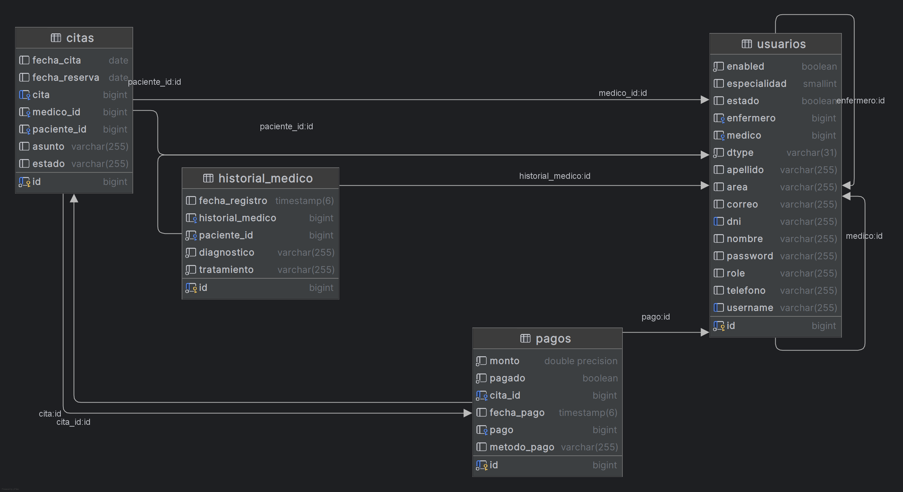

# HealthCare_Rampampan
 
**Curso:** CS 2031 Desarrollo Basado en Plataforma  
**Integrantes:**
- Carlos Enrique Angel Oriundo
- Matias Sebatias Sanchez Dominguez
- Ana Lucia Huapaya Yep
- Fabiana Antonella Ameri Ingaruca
- Juan Renato Flores Pascual

---

## Índice

1. [Introducción](#introducción)
2. [Identificación del Problema o Necesidad](#identificación-del-problema-o-necesidad)
3. [Descripción de la Solución](#descripción-de-la-solución)
4. [Modelo de Entidades](#modelo-de-entidades)
5. [Testing y Manejo de Errores](#testing-y-manejo-de-errores)
6. [Medidas de Seguridad Implementadas](#medidas-de-seguridad-implementadas)
7. [Eventos y Asincronía](#eventos-y-asincronía)
8. [GitHub](#github)
9. [Conclusión](#conclusión)
10. [Apéndices](#apéndices)

---

## Introducción

### Contexto
En la actualidad, la gestión eficiente de centros de salud representa un desafío clave para mejorar la calidad de atención a los pacientes. La digitalización de procesos administrativos y clínicos es fundamental para optimizar recursos, reducir errores y garantizar un servicio oportuno y seguro. HealthCare_Rampampan surge en este contexto con el propósito de brindar una plataforma integral que facilite la administración de pacientes, citas médicas y notificaciones, contribuyendo a un sistema de salud más organizado y accesible.

### Objetivos del Proyecto
- Desarrollar un sistema centralizado para la gestión de pacientes y citas médicas.  
- Implementar un control de acceso seguro basado en roles para proteger la información sensible.  
- Automatizar el envío de notificaciones para mejorar la comunicación entre profesionales y pacientes.  
- Garantizar la integridad y disponibilidad de los datos mediante pruebas y manejo adecuado de errores.  
- Facilitar la escalabilidad y mantenimiento del sistema con buenas prácticas de desarrollo y despliegue.

---

## Identificación del Problema o Necesidad

### Descripción del Problema
Muchos centros médicos enfrentan dificultades en la gestión manual o fragmentada de la información clínica y administrativa, lo que provoca retrasos en la atención, duplicidad de citas, errores en registros y baja satisfacción de pacientes y personal médico. La falta de sistemas integrados genera ineficiencias operativas y limita la capacidad de análisis y mejora continua.

### Justificación
Solucionar este problema es crucial para elevar la calidad del servicio de salud, optimizar recursos, y reducir riesgos asociados a errores humanos. Una plataforma digital integral contribuye a la transparencia, seguridad y eficiencia, aspectos vitales en el sector sanitario para garantizar bienestar y confianza tanto a usuarios como a profesionales.

---

## Descripción de la Solución
HealthCare_Rampampan es un proyecto orientado a facilitar la gestión y administración de citas médicas y pacientes en un sistema de salud. La solución permite organizar la información clínica y administrativa de manera eficiente, brindando un soporte digital que mejora la atención y seguimiento médico.

### Funcionalidades Implementadas

#### Gestión de pacientes
Registro, actualización y consulta de datos personales y clínicos de los pacientes.

#### Sistemas de citas
Creación, modificación, listado y cancelación de citas médicas, facilitando la agenda de los profesionales de salud.

#### Control de Usuarios
Gestión de roles y autenticación para garantizar acceso seguro y controlado.

#### Notificaciones por Email
Envío automático de confirmaciones y cancelación de citas a pacientes vía correo electrónico.

#### Manejo de Eventos Asíncronos
Implementación de eventos para procesar tareas en segundo plano, mejorando la performance y experiencia de usuario.

### Tecnologías Utilizadas

#### Backend
- **Lenguaje:** Java
- **Framework:** Spring Boot

#### Base de Datos
- **Motor:** PostgreSQL

#### Seguridad
JWT (JSON Web Tokens) para autenticación y autorización

#### Correo Electrónico
Spring Mail para SMTP

#### Herramientas de Desarrollo
- **Control de Versiones:** Git/GitHub
- **Testing:** Mockito
- **Deployment:** Docker, AWS
- **Gestión de Dependencias:** Maven
---

## Modelo de Entidades

### Diagrama de Entidades

### Descripción de Entidades

#### [Usuario]
Representa los usuarios del sistema con roles específicos (administrador, médico, etc.), con credenciales para acceso seguro.

#### [Paciente]
Contiene datos personales (nombre, apellido, DNI, teléfono, correo) que identifican al paciente.

#### [Médico]
Contiene información profesional de los médicos, incluyendo especialidad y datos de contacto profesional. Se relaciona con Citas e Historiales Médicos que atiende.

#### [Historial_medico]
Registra todas las consultas médicas, diagnósticos y tratamientos, creando un historial completo por paciente.

#### [Cita]
Registra la fecha, hora, estado y detalles de la cita médica vinculada a un paciente.

#### [email]
La entidad Mail representa los correos electrónicos enviados desde el sistema para notificaciones relacionadas con la gestión médica, como confirmaciones de citas, cancelación de cita o cambiar de fecha de cita.

---

## Manejo de Errores 

**Excepciones Globales Implementadas:**
- **ValidationError:** [Descripción y casos de uso]
- **AuthenticationError:** [Descripción y casos de uso]
- **DatabaseError:** [Descripción y casos de uso]

**Justificación:**
El manejo adecuado de errores es crucial para garantizar una experiencia de usuario fluida, evitar caídas inesperadas del sistema y proporcionar mensajes claros en caso de fallos, usamos las mejores prácticas creando nuestros propios error handling y usando un global exception handler.
---

## Medidas de Seguridad Implementadas
**Justificación:**
Creacion de jwt
---

### Seguridad de Datos
- **Autenticación y Autorización:** Uso de JWT para proteger rutas y validar identidad de usuarios.
- **Cifrado:** Contraseñas almacenadas cifradas con BCrypt.
- **Gestión de Permisos:** Control de acceso basado en roles para limitar operaciones según perfil.

### Prevención de Vulnerabilidades

- Validación de entradas para evitar **inyección SQL**.
- Uso de tokens CSRF o configuración adecuada para mitigar ataques de **CSRF** en formularios.

---

## Eventos y Asincronía 

#### Uso de Eventos
- Se utilizan eventos para manejar tareas que no requieren respuesta inmediata, como el envío de correos electrónicos de confirmación o recordatorio de citas.

- La implementación se realiza mediante el sistema de eventos de Spring, lo que permite desacoplar la lógica principal del procesamiento de estas tareas secundarias.

#### Beneficios de la Asincronía
- No bloqueo: Las operaciones pesadas o de espera, como el envío de emails, se procesan en segundo plano sin interrumpir el flujo principal del sistema.

- Mejora en la experiencia: Los usuarios reciben respuestas rápidas en la interfaz sin esperar a que estas tareas se completen.

- Escalabilidad: Facilita manejar múltiples solicitudes simultáneas y operaciones batch sin saturar el servidor.

#### Ejemplos de Eventos Asíncronos Implementados
- Envío automático de notificaciones por email tras la creación o modificación de una cita.

- Procesamiento en background de operaciones de actualización o sincronización de datos.

- Gestión de logs o auditorías que requieren almacenamiento diferido.
 
Todo esto es crucial para no afectar la experiencia del usuario y mantener la escalabilidad.

---

## GitHub

### GitHub Projects

#### Organización del Proyecto
**Metodología:** [Ej: Kanban, Scrum]  
**Boards Utilizados:** [Descripción de los tableros creados]

#### Gestión de Issues
- **Total de Issues:** 25
- **Issues Cerrados:** 20
- **Categorías:** Feature, Fix, Create

#### Deadlines y Milestones
- **Milestone 1:** 08/05/2025 - Inicio del proyecto, definición de requerimientos, conformación de equipos y diseño inicial del modelo de base de datos.
- **Milestone 2:** 23/05/2025 - Implementación de funcionalidades principales: gestión de pacientes, citas, usuarios
- **Milestone 3:** 25/05/2025 - Integración de seguridad con JWT, manejo de errores global, despliegue en contenedor Docker y presentación final.
- **Milestone 4:** 27/05/2025 - Envío de notificaciones por correo.

### GitHub Actions

---

## Conclusión

### Logros del Proyecto

- Desarrollo de un sistema funcional para gestión médica con funcionalidades clave.
- Implementación de seguridad robusta y manejo de errores.
- Uso eficiente de eventos asíncronos para mejorar la performance.

### Aprendizajes Clave

- Integración de Spring Boot con seguridad JWT.
- Manejo de eventos y asincronía en aplicaciones Java.
- Pruebas automatizadas y flujos CI/CD con GitHub Actions.(?)

### Trabajo Futuro

- Ampliar módulos de reporte y análisis de datos clínicos.
- Mejorar interfaz de usuario con front-end dedicado.
- Implementar notificaciones push y alertas en tiempo real.
 
---

## Apéndices

### Licencia
Este proyecto se distribuye bajo la licencia **MIT**

### Referencias
- [Spring Boot Documentation](https://spring.io/projects/spring-boot)
- [PostgreSQL Documentation](https://www.postgresql.org/docs/)
- [JWT (JSON Web Tokens) Official Site](https://jwt.io/)
- [GitHub Actions Documentation](https://docs.github.com/en/actions)(?)
- [Spring Security Reference](https://docs.spring.io/spring-security/reference/index.html)
